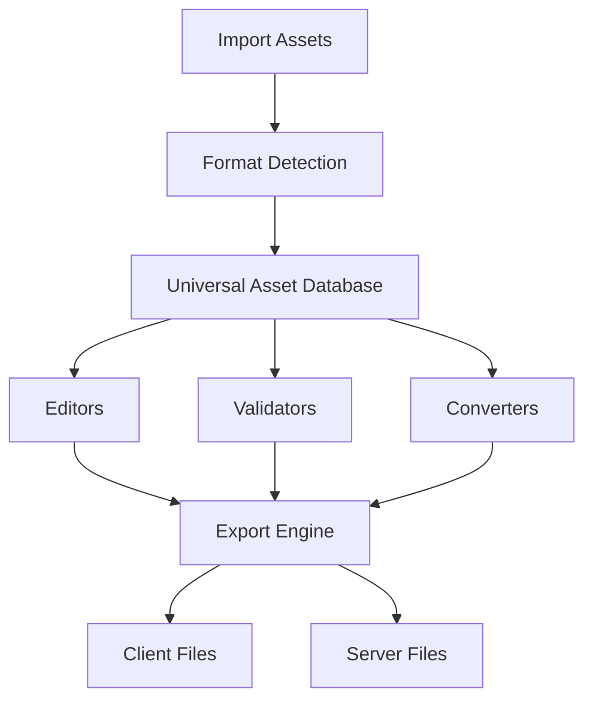

<p align="center">

# ⚒️ Tibia Asset Forge

### **Professional Asset Development Platform for Tibia**


</p>

<p align="center">


</p>

---

# 🚀 Overview

**Tibia Asset Forge** is a next-generation professional platform designed to create, edit, convert and manage Tibia assets across multiple client generations.

Instead of relying on multiple disconnected utilities, Tibia Asset Forge centralizes the complete asset pipeline into a single modern environment.

The platform is designed for developers, content creators and professional OpenTibia projects.

---

# 🎯 Vision

> **One Platform. Every Tibia Asset.**

For nearly two decades the OpenTibia community has relied on fragmented tools built for specific client versions.

Tibia Asset Forge was created to replace this fragmented workflow with a unified, extensible and production-ready asset development platform.

---

# ✨ Key Features

## 🎨 Asset Editing

- 🛡 Item Editor
- 👤 Outfit Editor
- 👹 Creature Editor
- 🧙 NPC Editor
- 💥 Magic Effects
- 🏹 Distance Effects
- 🖼 Sprite Viewer
- 📦 Asset Browser

---

## 🔄 Asset Conversion

Convert assets between multiple client generations.

```text
Tibia 15
      │
      ▼
Tibia Asset Forge
      │
      ▼
Tibia 8.54
```

---

## 📤 Import

Supported formats

- DAT
- SPR
- XML
- PNG

---

## 📥 Export

Generate

- items.otb
- items.xml
- outfits.xml
- appearances.xml
- effects.xml

---

# 🏗 Platform Architecture



---

# 🌍 Supported Platforms

| Family | Status |
|---------|--------|
| Tibia 7.x | 🟡 Planned |
| Tibia 8.x | 🟡 Planned |
| Tibia 9.x | 🟡 Planned |
| Tibia 10.x | 🟡 Planned |
| DAT Extended | 🟡 Planned |
| SPR Extended | 🟡 Planned |
| Modern Assets | 🔵 Research |

---

# 🖥 Workspace

Each project stores

- Assets
- Sprites
- Metadata
- Build Profiles
- Validation Rules

---

# ⚡ Development Philosophy

Every system inside Tibia Asset Forge follows the same principles.

✅ Modular

✅ Fast

✅ Extensible

✅ Version Independent

✅ Asset Oriented

---

# 🛠 Development Roadmap

## ✅ Phase 1

- Core Engine
- Asset Database
- DAT Parser
- SPR Parser

---

## 🔶 Phase 2

- Extended DAT
- Extended SPR
- Sprite Manager
- Asset Validation

---

## 🔷 Phase 3

- Conversion Engine
- OTB Generator
- XML Generator
- Batch Processing

---

## 🚀 Phase 4

- Modern Client Support
- Plugin System
- Automation
- Advanced Asset Pipeline

---

# 📸 Screenshots

## Dashboard


---

## Item Editor


---

## Sprite Editor


---

## Conversion Tool


---

# 🎯 Long-Term Goal

Create the definitive professional asset platform for the OpenTibia ecosystem.

One application.

Every asset.

Every client generation.

---

# 📄 License

**Tibia Asset Forge** is proprietary software.

All source code, assets and documentation are confidential and remain the exclusive property of the author.

Unauthorized copying, modification, redistribution or reverse engineering is prohibited.

---

<p align="center">

### ⚒ Tibia Asset Forge

**Professional Asset Development Platform**

© 2026 All Rights Reserved

</p>
